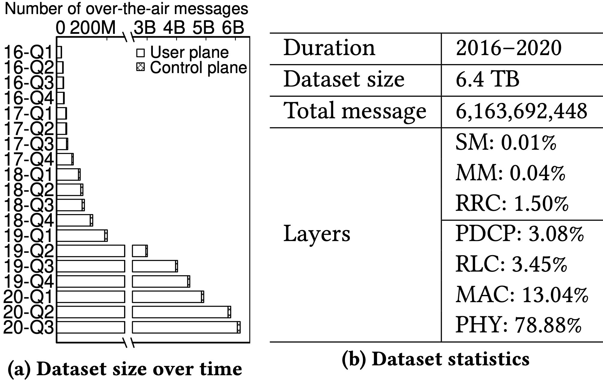

# Experience: A Five-Year Retrospective of MobileInsight

##### Yuanjie Li, Chunyi Peng, Zhehui Zhang, Zhaowei Tan, Haotian Deng, Jinghao Zhao, Qianru Li, Yunqi Guo, Kai Ling, Boyan Ding, Hewu Li, Songwu Lu

This repository contains the dataset and scripts of the MobiCom'21 paper "Experience: A Five-Year Retrospective of MobileInsight" [1]. 

## Overview

MobileInsight [2] is an open-source community tool to enable software-defined full-stack, runtime 4G/5G mobile network analytics inside our phones. In [1], we report our five-year lessons of developing and using MobileInsight. We present how MobileInsight evolves from a simple monitor to a community toolset with cross-layer analytics, energy-efficient real-time user-plane analytics, and extensible user-friendly analytics at the control and user planes. These features are enabled by various novel techniques, including cross-layer state machine tracking, missing data inference, and domain-specific cross-layer sampling. Their powerfulness is exemplified with a 5-year longitudinal study of operational mobile network latency using a 6.4TB dataset with 6.1 billion over-the-air messages. We further share lessons and insights of using MobileInsight by the community, as well as our visions of MobileInsight’s past, present, and future.

## Repository structure

This repository includes the following contents:

	|- mobicom21-data-release
		|- dataset       - The five-year dataset of the empirical studies in [1] 
		|- figures       - Source files of figures in [1]
		|- mobicom21.pdf - The MobiCom'21 paper [1]
		|- README.md     - This file

## Dataset

Since 2016, we have sporadically collected 4G/4.5G LTE over-the-air messages with the evolving MobileInsight and accumulated a five-year dataset. We ran MobileInsight over the test phones when using ping (primary), iperf, web, video streaming, or virtual reality applications in static, walking and driving scenarios. The following figure shows the accumulated dataset size every quarter and as of August 15, 2020. It has been collected from 50+ phone models and 58 global operators over 20+ countries and regions including the USA, China, India, South Korea, Singapore, France, Spain, Germany, Norway, Hungary, Egypt, Australia, New Zealand etc. Most data (82%) is collected in the US (AT\&T, Verizon, T-Mobile, Sprint, Google Fi), covering 39 states and 260,000+ miles. 

Due to the space limit by Github, this repository only includes a compressed metadata of all messages from our dataset. For the complete raw dataset, please contact support@mobileinsight.net for full access.

**How to analyze the dataset:** Analyzing these datasets requires MobileInsight. The following tutorials detail how to extract the signaling messages, configurations, and channel conditions in LTE mobility management in this paper:

- http://mobileinsight.net/get_started.html
- http://mobileinsight.net/get_started_desktop.html
- http://mobileinsight.net/tutorial-api.html
- http://mobileinsight.net/mobile_insight.analyzer.lte_measurement_analyzer.html
- http://mobileinsight.net/mobile_insight.analyzer.lte_rrc_analyzer.html
- http://mobileinsight.net/mobile_insight.analyzer.mobility_mngt.html

## Figures

Besides the original dataset, we alao release the figure traces used in [1]'s experiments, including

- Figure 6: Accuracy of MobileInsight compared to the infrastructure-side ground truth.
- Figure 7: Runtime messages at control and user planes.
- Figure 8: The initial MobileInsight’s user-plane analytics.
- Figure 9: MobileInsight’s energy-efficient real-time user-plane analytics.
- Figure 11: Summary of the dataset from MobileInsight.
- Figure 13: Control-plane signaling latency.
- Figure 14: User-plane latency and wireless bandwidth.
- Figure 16: Control-plane settings for user-plane delay.
- Figure 18: The device context’s impact on LTE latency.

## Citation

Please indicate the source-link when using it and cite our MobiCom paper [1]. 

## Contact
Please contact support@mobileinsight.net for any questions or technical support.

## References

[1] Yuanjie Li, Chunyi Peng, Zhehui Zhang, Zhaowei Tan, Haotian Deng, Jinghao Zhao, Qianru Li, Yunqi Guo, Kai Ling, Boyan Ding, Hewu Li, Songwu Lu, ""Experience: A Five-Year Retrospective of MobileInsight", ACM MobiCom 2021

[2] MobileInsight, https://www.mobileinsight.net

## License

